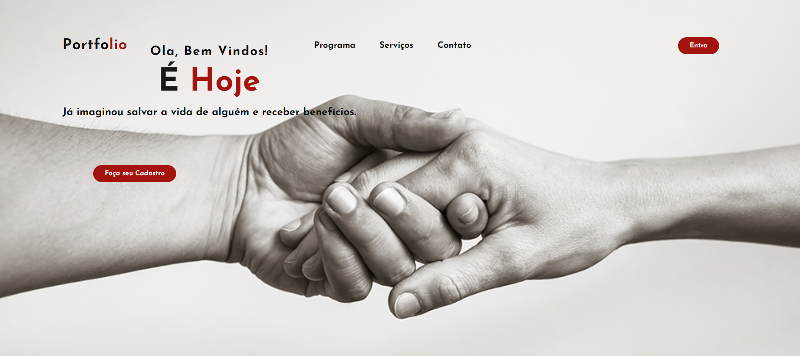

# Meu Projeto

Este projeto é uma landing page, desenvolvido nas aulas de front-end.

**/

# Índice

* [Descrição do Projeto](#descrição-do-projeto)
* [Status do Projeto](#status-do-projeto)
* [Funcionalidades e Demonstração da Aplicação](#funcionalidades-e-demonstração-da-aplicação)
* [Acesso ao Projeto](#acesso-ao-projeto)
* [Tecnologias Utilizadas](#tecnologias-utilizadas)
* [Pessoas Desenvolvedoras do Projeto](#pessoas-desenvolvedoras-do-projeto)

## Descrição do Projeto

Um projeto de doação de sangue em troca de benefícios é uma iniciativa que visa incentivar as pessoas a doarem sangue regularmente, fornecendo recompensas ou incentivos em troca de suas doações. O objetivo principal deste projeto é aumentar o fornecimento de sangue disponível para hospitais e bancos de sangue, garantindo assim que haja sangue suficiente para atender às necessidades dos pacientes. Aqui está uma descrição geral de um projeto desse tipo: É Hoje Programa de Doação de Sangue em Troca de Benefícios. 

### Como surgiu o Meu Projeto:

Lorem Ipsum is simply dummy text of the printing and typesetting industry. 
Lorem Ipsum has been the industry's standard dummy text ever since the 1500s, 
when an unknown printer took a galley of type and scrambled it to make a type 
specimen book. It has survived not only five centuries, but also the leap into 
electronic typesetting, remaining essentially unchanged. It was popularised in 
the 1960s with the release of Letraset sheets containing Lorem Ipsum passages, 
and more recently with desktop publishing software like Aldus PageMaker 
including versions of Lorem Ipsum.

## Status do Projeto 

``Em construção``

## Funcionalidades e Demonstração da Aplicação

- `Funcionalidade 1`: descrição da funcionalidade 1
- `Funcionalidade 2`: descrição da funcionalidade 2
- `Funcionalidade 3`: descrição da funcionalidade 3

## Acesso ao Projeto

### Para acessar ao projeto:
**Indique como é possível baixar ou acessar o código fonte do projeto, seja projeto inicial ou final**

###  Para abrir e rodar o projeto:
**Apresente as instruções necessárias para abrir e executar o projeto**

## Tecnologias Utilizadas

- ``HTML 5``
- ``CSS 3``
- ``JavaScript``

## Pessoas Desenvolvedoras do Projeto

[Tereza Oliveira](https://github.com/TerezaOliveira90)